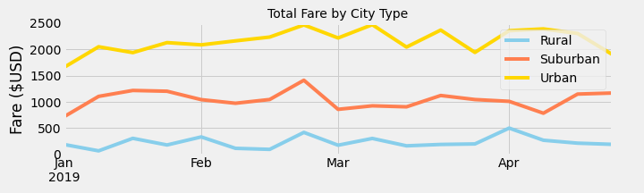
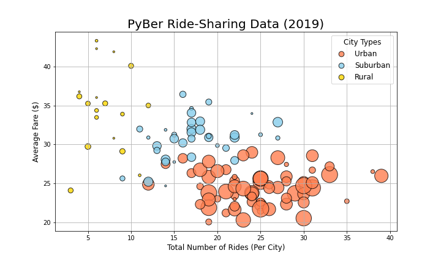
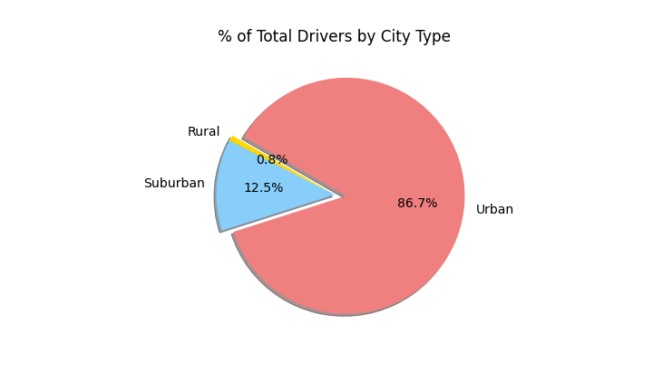

# PyBer_Analysis
## PyBer's 2019 Business Analyzed by City Type
Using Python and Pandas we have analyzed Pyber's 2019 ride and fare data for patterns and growth opportunities.

## Results
### Comparing the fares generated by PyBer in rural, suburban and urban cities
An analysis of total rides, total drivers, total fares, average fare per ride, average fare per driver, and total fare by city type, we have identified distinct differences between the business PyBer transacts in rurual suburban and urban cities. As the following chart illustrates, urban cities consistantly bring in the most money and the most trips over all of the weeks examined. But the rural and suburban cities show the most growth potential if the driver pool can be increased in both types of region.

 

 

Note: Size of the bubbles in the chart correlates with the amount of drivers working.

## Summary - Recommendations based on the data
### * Growth opportunities in rural areas from recruiting more drivers
The analysis of PyBer's 2019 ride data shows that 6.8% of total fare revenue came from rural cities, derived from 5.3% of PyBer's total rides. In other words, fewer rides led to more revenue in rural areas because the average cost per ride is higher in rural areas. But the rural cities also have less than 1% of PyBer's drivers. This data suggests that recruiting more drivers in rural cities is likely to lead to an increase in revenue in these regions.

### * Growth opportunities also exist in the suburban regions
While suburban fares are not as high as rural fares, they are somewhat higher than urban fares. And since suburban cities generate 30% of PyBer's total fares with only 12.5% of PyBer's drivers there is strong reason to believe that adding more drivers in suburban cities will lead to an increase in PyBer revenue.

### * Urban driver counts need to be maintained at the current level 
Although there are clear growth opportunities in the rural and suburban areas, urban cities are likely to remain the largest source of PyBer's revenue because they generate large volumes of shorter rides. So, although incentives should be put in place to recruit more rural and suburban drivers, PyBer should also take measures to preserve the number of drivers in urban regions.

